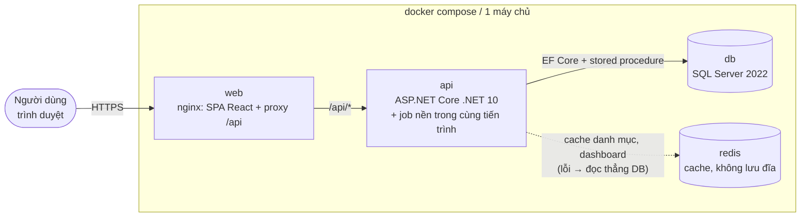
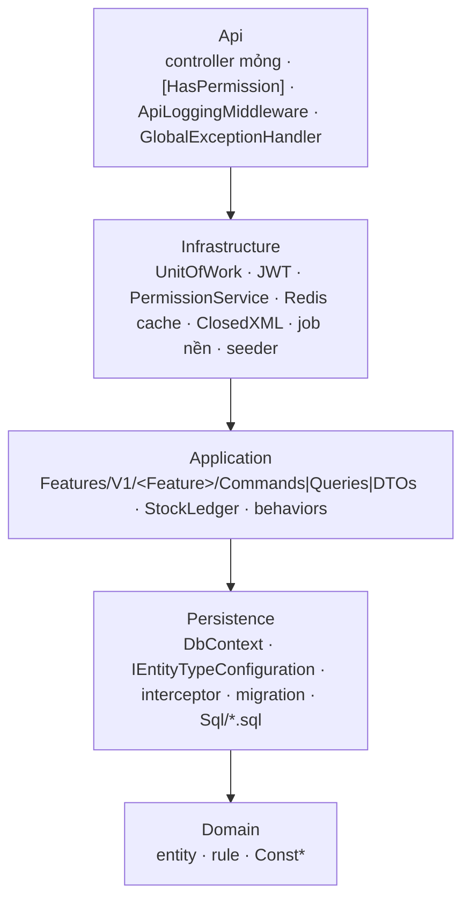
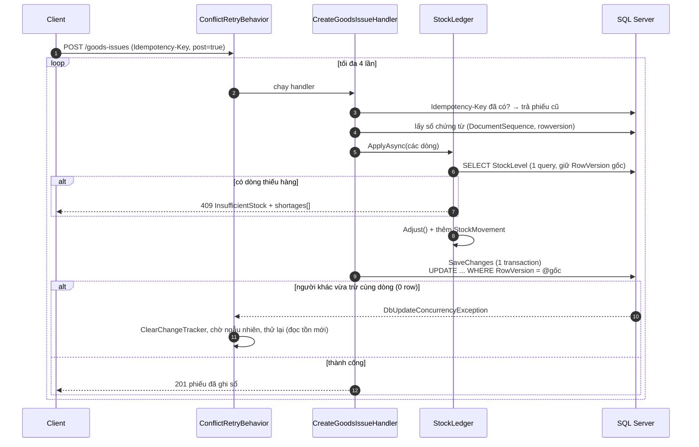
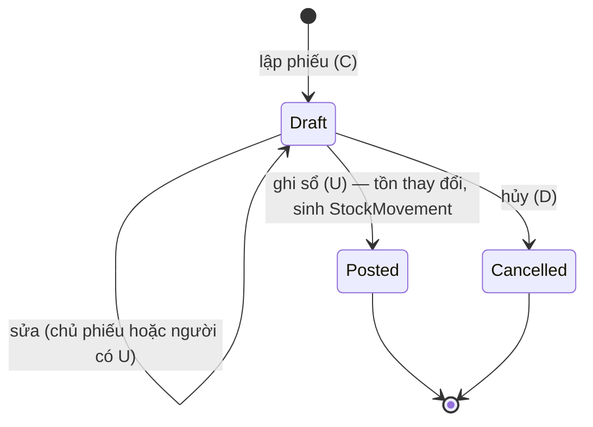
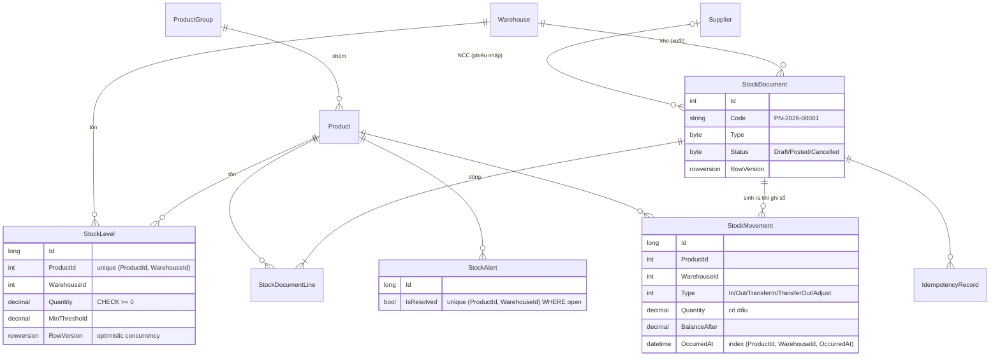

# Kiến trúc — Inventory / Warehouse

Tài liệu này mô tả hệ thống **như code hiện tại đang chạy**. Luật code nằm ở [backend/RULES.md](../backend/RULES.md); cách chạy và các số đo nằm ở [README](../README.md).

## 1. Triển khai (container)

- **Không có trạng thái trong `api`:** chạy nhiều bản được. Cache nằm ở Redis, quyền được cache theo version token; job cảnh báo chống trùng bằng unique index.
- **Redis là tùy chọn:** không cấu hình `ConnectionStrings:Redis` thì dùng cache bộ nhớ. Redis chết thì request vẫn chạy (timeout 500 ms rồi đọc DB).
- **Job nền** (`BackgroundService`): ghi log API theo lô, dọn log cũ, quét tồn thấp mỗi 5 phút.

## 2. Các lớp backend

Pipeline MediatR của mọi request: `LoggingBehavior → ValidationBehavior → ConflictRetryBehavior → Handler`.

## 3. Luồng quan trọng nhất: ghi sổ phiếu xuất khi nhiều người tranh cùng hàng

Tồn không bao giờ âm vì có ba lớp chặn: `StockLedger` kiểm tra mọi dòng, `StockLevel.Adjust`, và CHECK constraint `CK_StockLevels_Quantity_NonNegative` trong DB. `StockConcurrencyTests` chứng minh điều này: 6 phiếu × 3 cái bắn vào tồn 10 → đúng 3 phiếu thành công, tồn còn 1.

## 4. Vòng đời chứng từ

Phiếu `Posted` là bất biến. Sai thì lập phiếu kiểm kê hoặc phiếu ngược lại. Mọi thao tác đổi trạng thái đều phải gửi `rowVersion` của phiếu.

## 5. Dữ liệu kho

- `StockMovement` là **sổ cái bất biến**: chỉ thêm, không sửa, không xóa mềm. Thẻ kho (`usp_Report_Kardex`) tính tồn cuối lũy kế bằng window function trên bảng này.
- Tổng `StockMovement.Quantity` của một (sản phẩm, kho) luôn bằng `StockLevel.Quantity` (có test).
- Bảng phân quyền `Sys_*` (6 bảng), log API và refresh token giống hệt template ở [Dự án #1](../../Helpdesk-Ticketing/README.md).

## 6. Quyết định thiết kế đáng chú ý

| Quyết định | Lý do | Đánh đổi |
|---|---|---|
| Một bảng `StockDocument` cho 4 loại phiếu | Một `StockLedger` và một luồng tạo/sửa/ghi sổ/hủy dùng chung | Vài cột chỉ có nghĩa với một loại (`SupplierId`, `ToWarehouseId`, `Reason`) |
| Optimistic concurrency (rowversion) + thử lại cả use case | Không khóa hàng lúc đọc, tranh chấp hiếm thì rẻ | Tranh chấp dày đặc thì có thể thử hết 4 lần → trả 409 |
| Import ghi theo lô 500 dòng | 20.000 dòng không timeout, change tracker nhỏ | Đứt giữa chừng thì một phần đã ghi — chấp nhận được vì là upsert idempotent |
| Dashboard cache 30 s | SP quét toàn bộ tồn (~170 ms trên 12k mã) | Số liệu trễ tối đa 30 s (hiện "Số liệu lúc …") |
| Job nền trong tiến trình API (không dùng Hangfire) | Ít thành phần, đủ cho một job định kỳ | Không có UI theo dõi job; nhiều instance thì cùng quét (đã an toàn nhờ unique index) |
